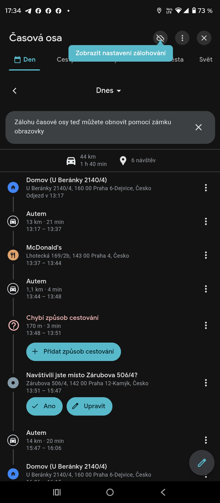

# Martinec – pes, vměšování do soukromí a doložení pohybu

Přikládám rovněž další příklad komunikace pana Martince, kterou považuji za nepřiměřené vměšování do mého soukromého života. Není mi zřejmé, z jakého důvodu se vyjadřuje k mému psovi, obzvlášť za situace, kdy se svého vlastního psa sám zbavil.

Pro úplnost zasílám také přesný časový přehled svého pohybu, včetně míst a časů. Tento přehled vyvrací tvrzení, že bych byl mimo domov celý den.

Další otázky k této věci si ponechám na schůzi SVJ.

Zároveň uvádím, že jsme si pořídili robotickou chůvičku / kamerový monitoring bytu, díky kterému máme přesný přehled o dění v jednotlivých místnostech. Z dostupných informací nemám za to, že by se jednalo o situaci obdobnou dřívějším případům, kdy pes štěkal skutečně dlouhodobě, například celý den.

Děkuji za upozornění. V době Vaší zprávy jsem již byl fakticky na cestě zpět.

## Příloha

- Screenshot / časová osa: [fotky/martinec_pes.png](fotky/martinec_pes.png)

